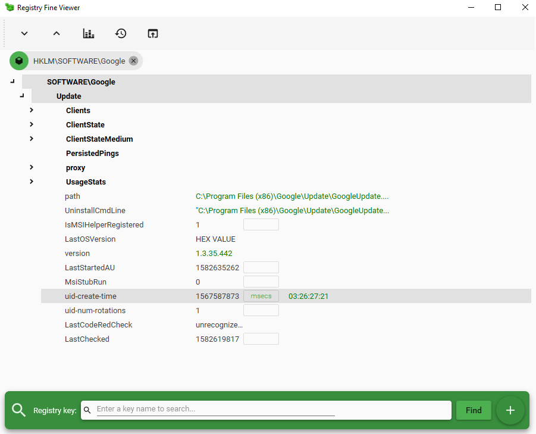

# RegFineViewer
RegFineViewer is an utility to visualize and navigate easily the Windows Registry.

## Installation

Decompress the Zip archive and run **RegFineViewer.exe**.

## Usage

With the utility, you can open a Reg file or open the local registry hive, expand, collapse and navigate the TreeView, search for a specific key or value, 
and associate units to the keys for an immediate conversion.

Example:

`DurationInSec .... DWORD .... 0x0000012C` : click on `[seconds]` and its displays `00:05:00`.

