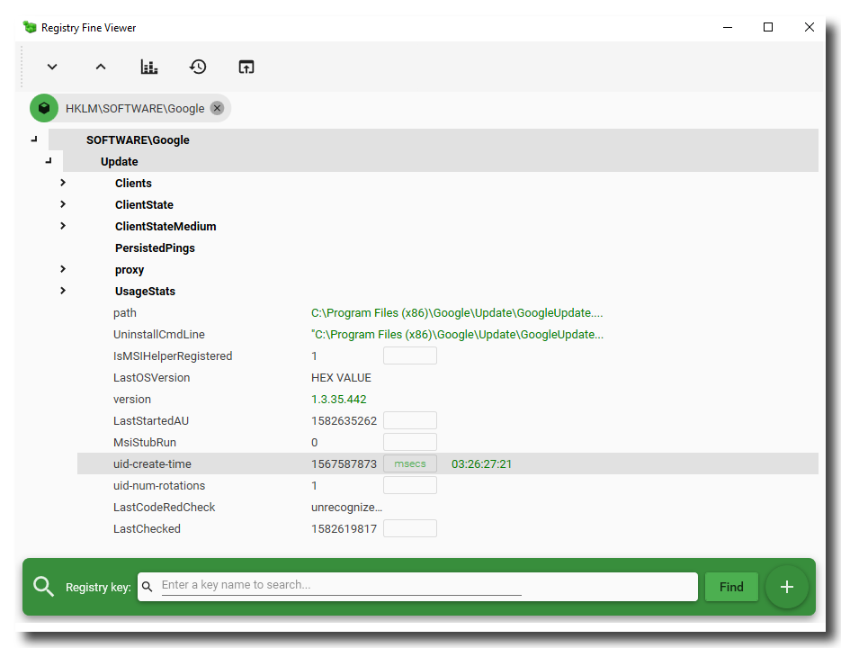
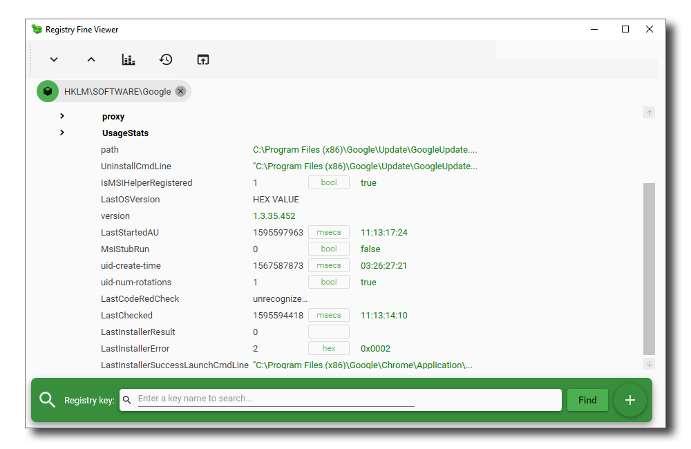
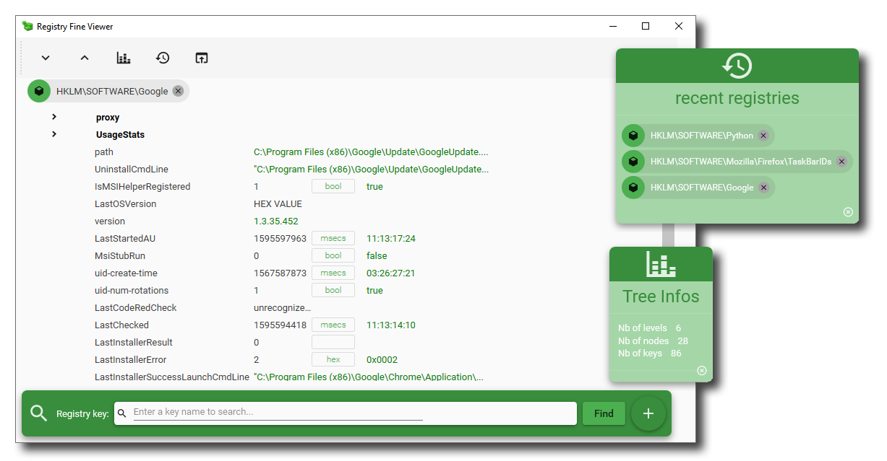

# Registry Fine Viewer for Windows

**Registry Fine Viewer** is an utility that allows you to navigate and view the content of the Windows Registry.
The application use _Material Design_ convention and look-and-fell for a responsive and user-friendly ergonomy.

## Features

This application:
- can open any registry file (`.reg` extension) by drag and drop
- can open the registry of the computer
- display the values of the key in various units (raw, hex, seconds, ...)
- memorize the units you have used, so if you open later another regsitry with similar keys, the units will already be correct.
- seach any key or value in the registry tree

## Screenshots

## Installation

Get the latest release of the software by clicking on the **▼.ZIP** button, at the top of this page, or [here: "latest release"](https://github.com/Sphinkie/RegFineViewer/releases/latest).

Download the **RegFineViewer.v1.4.Portable.zip** file, and unzip it in a folder on your computer.
Then, just run the **RegFineViewer.exe** program.

## About me

Find my other softwares at [GitHub](https://sphinkie.github.io).

