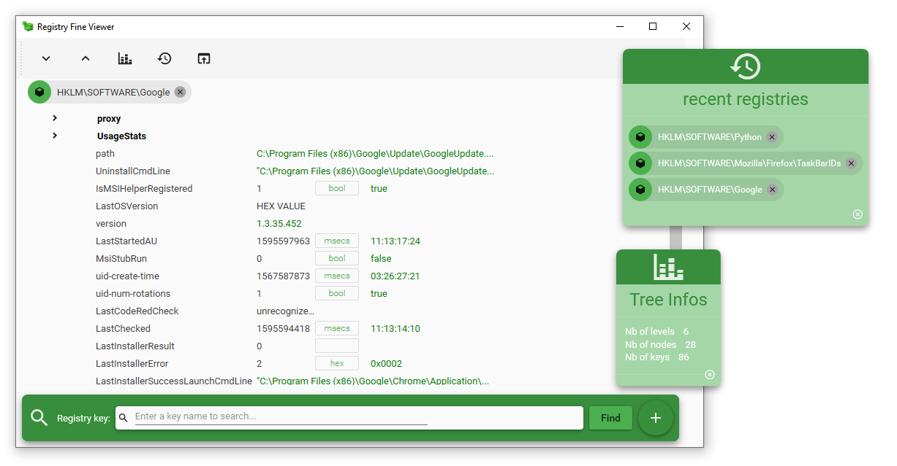
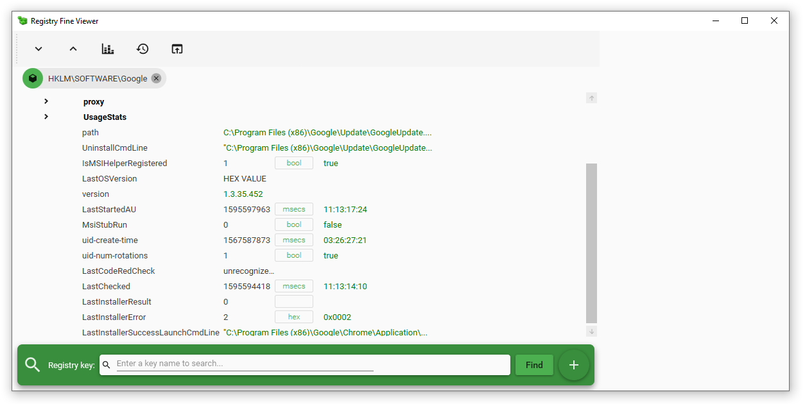

# Registry Fine Viewer

**Registry Fine Viewer** is an utility that allows you to navigate and view the content of the Windows Registry.
The application use _Material Design_ convention and look-and-fell for a responsive and user-friendly ergonomy.

## Features

This application:
- can open any registry file (`.reg` extension) by drag and drop
- can open the registry of the computer
- display the values of the key in various units (raw, hex, seconds, ...)
- memorize the units you have used, so if you open later another regsitry with similar keys, the units will already be correct.
- seach any key or value in the registry tree

## Screnshots

[markdown support](https://docs.github.com/categories/github-pages-basics/)
